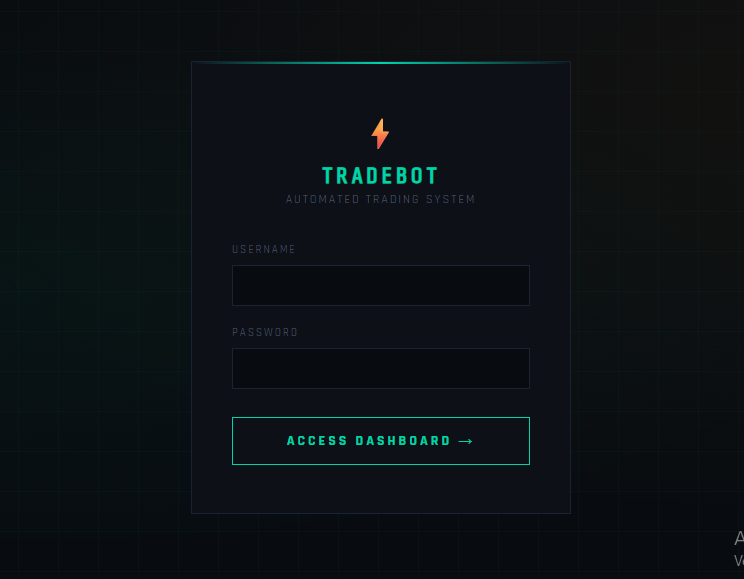

# ⚡ Module 3 — Full Trading Automation System + Dashboard



Complete trading automation system built from scratch. Receives TradingView signals, executes orders on Binance Spot, stores all activity in a database, and displays everything in a real-time web dashboard.

---

## 📌 Overview

**Flow:**

```
TradingView Alert → Webhook → Parse Signal → Execute on Binance → Save to DB → Dashboard
```

---

## ⚙️ Features

- Receives TradingView webhooks and parses semi-structured signals
- Executes **market orders** on **Binance Spot** automatically
- Stores all signals and orders in **SQLite** database
- **Web dashboard** with login protection showing:
  - Account balance (real-time)
  - Open orders (auto-refresh every 30s)
  - Order history
  - Signal history
  - Bot stats (total signals, filled orders, errors)
- Health check endpoint `/health`
- Testnet mode for safe testing

---

## 🛠️ Tech Stack

| Layer      | Technology       |
| ---------- | ---------------- |
| Web server | Python 3 + Flask |
| Binance    | python-binance   |
| Database   | SQLite           |
| Frontend   | HTML + CSS + JS  |
| Config     | python-dotenv    |

---

## 🚀 Getting Started

### 1. Install dependencies

```bash
pip install -r requirements.txt
```

### 2. Configure credentials

```bash
cp .env.example .env
# Edit .env with your keys
```

### 3. Run the server

```bash
python app.py
```

### 4. Open the dashboard

```
http://localhost:5002
```

Login with the credentials set in `.env` (default: `admin` / `admin123`).

### 5. Test with demo

```bash
python demo.py
```

---

## 📡 TradingView Webhook Payload

```json
{
  "secret": "your_secret",
  "symbol": "{{ticker}}",
  "price": "{{close}}",
  "side": "BUY"
}
```

Webhook URL: `http://your-server:5002/webhook`

---

## 🔧 Configuration (.env)

| Variable              | Description                | Default      |
| --------------------- | -------------------------- | ------------ |
| `BINANCE_API_KEY`     | Binance API key            | required     |
| `BINANCE_API_SECRET`  | Binance API secret         | required     |
| `BINANCE_TESTNET`     | Use testnet                | true         |
| `SECRET`              | Webhook secret             | mysecret     |
| `TRADE_USDT_AMOUNT`   | Default trade size in USDT | 10           |
| `RISK_PERCENT`        | Risk per trade             | 0.005 (0.5%) |
| `ENABLE_AUTO_EXECUTE` | Enable auto execution      | true         |
| `DATABASE_PATH`       | SQLite file path           | trading.db   |
| `DASHBOARD_USER`      | Dashboard username         | admin        |
| `DASHBOARD_PASS`      | Dashboard password         | admin123     |

---

## 🔮 Roadmap

- [x] Module 1 — Signal notifications via Telegram
- [x] Module 2 — Automatic order execution via Binance API
- [x] Module 3 — Full system + real-time dashboard

---

## 👨‍💻 Author

**Mauro Dev** — Python Developer | Trading Automation Specialist  
[Upwork Profile](https://www.upwork.com/freelancers/~016463e7b3cbc8fa20)
